# Architecture and evaluation contract

## Scope

Local, single-user evaluation of Markdown/CSV document agents. The application is
not a hosted multi-tenant service. Default binding is loopback. There is no model-generated
code execution, browser control, arbitrary host-file tool or external-agent adapter in v0.1.

```mermaid
flowchart LR
  UI[Web UI / CLI] --> DB[SQLite experiment queue]
  DB --> W[Exclusive Worker process]
  W --> I[Inspect Task / Solver / Scorer]
  I --> R[Original Agent Runtime]
  R --> V[Per-trial virtual files and state]
  V --> G[Rule graders]
  G --> E[Trace / artifacts / report]
  E --> H[Human review / LLM Judge]
  H --> C[Calibration and regression]
```

## Separation of responsibilities

- `agentbench/schema.py`: validated cases, assertions, experiment and review payloads.
- `dataset.py`: task-family split checks, immutable imported JSON versions, selection.
- `environment.py`: virtual tools, task-local state, repeatable fault injection.
- `agents.py`: adapter around the original loop; scripted demo or real serial tool calling.
- `inspect_tasks.py`: native Inspect solver/scorer; called by the Worker and Inspect CLI.
- `runner.py`: manifest creation, queue claim, progress persistence, resume policy.
- `storage.py`: SQLite with short transactions, append-only human/Judge history.
- `grading.py`: objective constraints; no model calls and no mean score overriding a failure.
- `judge.py`: semantic evaluation independent of rule scores; evidence and rubric validation.
- `analysis.py`: coverage, failure hints, task-clustered paired bootstrap, human-Judge agreement.
- `api.py`, `static/`: local UI, CSRF-protected mutations, same-origin policy.

## Agent / evaluator boundary

Agents see user turns, the common system prompt, tool schemas and tool outputs. They
do not receive `checks`, the reference field, dataset split, grading code, or future user turns.
The real adapter only receives public task material. Scripted demo clients are explicitly
an exception: they know fixture actions/answers and do not measure AI ability.

Every trial starts with new virtual files/todos/idempotency keys and a new temporary
SQLite session database. The temporary database is cleaned up; complete relevant messages,
traces, files and state are serialized into the experiment database. Original time-dependent
context is replaced with a fixed evaluation clock. A time limit applies to the entire case;
max_steps applies to each user turn, as in the original loop. Context budgets count characters,
not tokens. Original deterministic summarization remains a baseline, not an improved algorithm.

## Judging contract

The final answer is a JSON object with `answer` (string), `values` (object), `citations`
(list of fixture paths), and `abstain` (boolean). This explicit output contract makes numeric
and state comparisons reproducible, but does not capture all natural-language correctness.

`citations` checks required path coverage and validity only; it is NOT proof of entailment.
`evidence_recall` measures whether relevant full files were exposed through a tool; it is NOT
a ranking metric or a complete RAG evaluation. Search is substring search, not embedding retrieval.
Rule-based numeric grading checks the `values` field. A contradictory natural-language explanation
may still pass those checks and should be identified by Judge/human review. File-edit tasks explicitly
require exact other-character preservation, making byte/text equality appropriate in this suite.

All hard checks plus normal termination must pass. Per-criterion results stay available.
LLM error, timeout, repeated-call stop and step exhaustion are distinct termination reasons;
an orchestration exception is an infrastructure error. `completed` describes finished evaluation,
not all samples passing. Infrastructure errors remain visible and block a valid comparison.

Judge v1 is intentionally underspecified for comparison; v2 has anchored 0–2 dimensions,
required evidence snippets and an uncertain outcome. Both output the same JSON schema. Evidence
snippets are checked for exact occurrence. This blocks fabricated snippets, not all reasoning mistakes
or injection attacks. There is no claim of a proven secure or bias-free judge. No hidden chain of thought
is requested; explanations are short evidence-based grading reasons.

## Statistics and reproducibility

- Success rate uses all planned trials as denominator. During execution this is a lower bound.
- Scored-only rate and scored coverage are separately returned. API/provider usage missing or
  incomplete (including retries/errors) produces unknown usage/cost, never a fabricated zero.
- Cost is an estimate in the user's chosen common currency using explicit prices per million
  input/output tokens; cache discounts and failed-request billing are not estimated.
- Paired comparisons require completed runs, matching dataset hash, scorer version, case IDs,
  repetition indices and demo/real mode. Different config fields are displayed. The user must
  control confounders; an equal task set alone cannot identify causation.
- Bootstrap samples task-level deltas; repeats are clustered within their task. There are 2,000
  resamples with seed 42. Very small/nonrepresentative sets limit inference. No industry ranking.
- Strict CLI gate rejects incomplete comparison, any pass→fail transition or an overall drop
  beyond the supplied threshold. It is deliberately conservative for small regression suites;
  statistical uncertainty is reported, not silently turned into a significance-based release policy.
- A manifest stores selected task snapshots, full dataset hash, config, prompt hash, source hash,
  commit, dependency version, generation settings and demo-script hash. Inspect logs are under
  `data/inspect_logs/<run_id>`. The outer Inspect model is `mockllm/model` because the custom solver
  owns real API calls; actual target identity is recorded in the Lab manifest. Inspect's outer model
  name and token counter MUST NOT be mistaken for the target model or its usage.
- Resume preserves completed/error records and retries only unfinished trials. Worker startup
  recovers running jobs to interrupted while holding an exclusive filesystem lock. Source or demo
  script changes block resume. Provider identity/versions and availability can change externally;
  record pinned model versions when the provider supports them.

## Human calibration

Human review hides identity and auto scores in the review dialog/API, but is not a guarantee that
the reviewer never saw those values previously. Labels are append-only and latest per reviewer is
used. Conflicting/uncertain human labels and judge failures/uncertainty are excluded with counts.
Agreement and Cohen's κ refer to human consensus versus Judge, not inter-annotator agreement.
Single-class degenerate κ is null. The number of reviewers is reported. The application does not
create fake human labels or automatically promote draft tasks to reviewed.

## Operations

`serve` starts one independent Worker. A local file lock prevents concurrent Workers from running
the same data directory. `--no-worker` supports managing a Worker separately. Cancellation stops new
samples; already running calls finish or hit the per-case timeout. Stopping the server terminates its
child Worker; the next startup marks unfinished work interrupted. Run only one server per data root.
CLI `worker --once` claims the oldest queued experiment. Keys are read from environment variables;
URLs with credentials/query fragments are rejected. Data, logs, `.env` and local screenshots are
excluded from Git. This is a local tool, not an authenticated network service.

## Next extensions

Independent dataset review; stronger semantic assertion types; position-swapped pairwise judging;
real tokenizer budgets; retrieval/reranking adapters; nanobot integration; DOCX/PDF structural and
rendered-layout checks; larger private holdouts; container environments via Harbor. These are not
advertised as implemented v0.1 capabilities.
